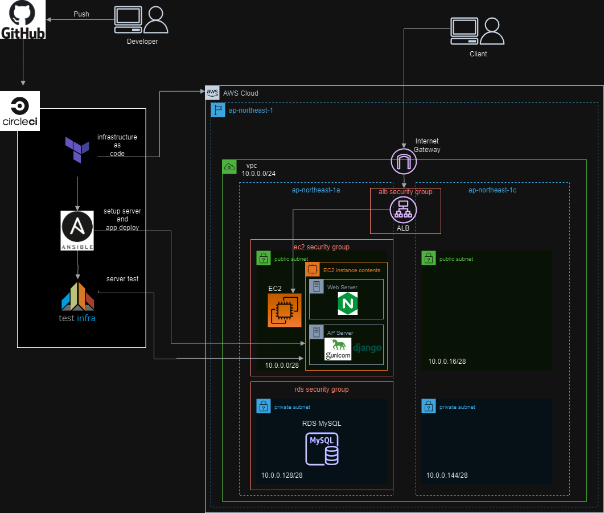

# 前提
* GitHubのアカウントを持ち、Gitと連携して使える
* AWSのアカウントを持っており手動でリソースの構築ができる
* CirclCIのアカウントを持っておりプロジェクト作成できる
* PythonインタープリタにてDjangoのSecretKey用の文字列を生成できる

# システムアーキテクチャ
このリポジトリでは下記のような構成でDjango製のrestfulAPIのデプロイを行う。  

**※ALB長期運用は大きな費用がかかるため、使わない場合の環境削除を忘れずに**
# How to Build Environment
* 予めGitHubの新規リポジトリを作成してCirclCIプロジェクトと紐付けておく
* AWSの操作用のアクセスキーIDとアクセスキーの準備と、terraformの状態を管理するようのS3bucketを事前に作成しておく
* リポジトリをローカル環境に取り込み、remoteリポジトリを上記のリポジトリに変更する  
```git clone https://github.com/dende-h/sampleMemoApi.git```  
```git remote set-url [自分のリモートリポジトリのURL]```
* CirclCIにEC2にアクセスするためのsshキーを登録する  
    Project > Project settings > SSH Keys > Additional SSH Keys  
    登録した際に発行されるフィンガープリントを下記環境変数に登録する
* CirclCIにプロジェクトの環境変数を設定する  
    Project > Project settings > Environment Variables  
    ```
    AWS_ACCESS_KEY_ID = terraformで環境構築するための権限付与されたAWSアクセスキーID
    AWS_SECRET_ACCESS_KEY = 上記アクセスキーに対応したアクセスキー
    DB_HOST = 127.0.0.1 アプリのテスト用MySQLホストIP
    DB_NAME = MySQLに構築するデータベース名
    DB_PASSWORD = MySQLアクセスパスワード
    DB_PORT = 3306
    DB_USER = MySQLユーザー名
    KEY_FINGERPRINT = CirclCIにssh接続キーを登録した際発行されたフィンガープリント
    SECRET_KEY = DjangoApp用のsecretkey文字列
    TFSTATE_STORAGE = terraformの状態を保存するS3bucket名
    TF_VAR_keypair_name = ssh接続用のKeypiarのファイル名
    TF_VAR_rds_password = RDS用のパスワード
    ```
* sampleMemoApi/.circleci/config.ymlのパラメータ確認  
    **true**だとdestroyで環境を削除、**false**だと環境を構築
    ```yaml
    parameters:
        run-terraform-destroy:
            type: boolean
            default: false #ここをtrueに変更後にPushするとterraform destroyを実施するジョブが走ります。
    ```
* リモートリポジトリにpushすることでCirclCIが動作して、パラメータによって環境構築と削除を行う。
* mainブランチ以外のpushではアプリのテストと、terraform planのみ実行します。mainにmergeすることで構築まで実行出来る。最初は別ブランチを切って動作確認を推奨。

# How to Setup Application
### クイックスタート
* ssh接続でEC2にアクセスし、コマンドで操作する
* プロジェクトルートに移動  
```cd /sampleMemoApi/```
* 仮想環境へ入る  
```source venv/bin/activate```
* maigrateコマンド実行  
```python manage.py migrate```
* nginxのデフォルト設定のシンボリックリンクを削除  
```sudo rm /etc/nginx/sites-enabled/default```
* 静的ファイルをstaticfilesディレクトリに集める  
```sudo chown -R $(whoami) /sampleMemoApi```（権限付与）  
```python manage.py collectstatic```
* Nginxの再起動  
```sudo systemctl restart nginx```  
* terraformでアプトプットされた```http://[ALBのエンドポイント]/admin```にアクセスして、管理画面へのログインが表示されたらOK。

### 管理ユーザーの作成
* Pythonコマンドでスーパーユーザーを作成  
```python manage.py createsuperuser```
* ユーザー名、メールアドレス、パスワードを入力
* 管理画面ログイン時は**メールアドレスとパスワード**を使用する

### model変更した場合 
* migrationsディレクトリにadminユーザーから書き込める権限を付与  
```sudo chown -R $(whoami) /sampleMemoApi/memos/migrations/```  
* 新しいマイグレーションを作成する  
```python manage.py makemigrations```  
  
### 仮想環境から離れる
```deactivate```

### swaggerでAPI仕様書を表示
* ```http//:[ALBエンドポイント]/schema/swagger-ui```にアクセスするとAPI仕様書を閲覧可能
* ```http//:[ALBエンドポイント]/schema/redoc/```にアクセスするとAPI仕様書を閲覧可能

### nginxのエラーログ確認
```tail -F /var/log/nginx/error.log```  
* tail:  
tail コマンドは、テキストファイルの末尾の内容を表示するために使用されます。デフォルトでは、ファイルの最後の10行を表示します。  
* -F :  
このオプションは、ファイルがローテート（古いログファイルが新しいファイルに置き換えられるプロセス）されても追跡を続けるようにtailに指示します。つまり、ファイルが削除されて新しいファイルが同じ名前で作成された場合でも、新しいファイルの内容を続けて表示します。
この振る舞いは、特にログファイルを扱う際に役立ちます。ログファイルは定期的にローテートされることが一般的で、-F オプションは新しいログファイルへの移行を透過的に扱うことができます。

# アプリをカスタマイズしたい場合
アプリをカスタマイズしたい場合、開発環境の構築にVScodeのdevcontainerを使ったリモート接続が便利。
下記の開発コンテナを作成して、その中にプロジェクトをCloneするとすぐ開発可能。  
Cloneしたプロジェクトに移動して```pip install -r requirements.txt```でライブラリインストール完了。 
WindowsPCの方はWSL2でLinux環境を作成して利用を推奨。   
### 開発時に使っていた環境設定ファイルの内容
**.devcontainer**
```json
{
	"name": "Django Sample",
	// Dockerfileでイメージ・コンテナを作成
	"dockerComposeFile": "docker-compose.yml",
	// リモート先のVS Codeにインストールする拡張機能
	"service": "web",
	"workspaceFolder": "/workspace",
	"shutdownAction": "stopCompose",
	"customizations":{
		"vscode":{
			"settings": { 
				"python.analysis.extraPaths": [
				"/usr/local/lib/python3.12/site-packages"
				],
				"[python]": {
					"editor.defaultFormatter": "ms-python.black-formatter",
					"editor.formatOnSave": true
				  }
			},
			"extensions": [
				"ms-azuretools.vscode-docker",
				"ms-python.python",
				"ms-python.vscode-pylance",
				"HashiCorp.terraform",
				"circleci.circleci",
				"redhat.vscode-yaml",
				"batisteo.vscode-django",
				"thebarkman.vscode-djaneiro",
				"ms-python.black-formatter"
			]
		}
	}		
}
```
**docker-compose.yml**  
```yml
version: '3'

services:
  web:
    build: .
    tty: true
    # ローカル環境からterraform使用する際の環境変数。GitHubに上げないように注意。ローカル環境でterraform使用しないなら不要
    environment:
      AWS_ACCESS_KEY_ID: [自身のアクセスキーID]　
      AWS_SECRET_ACCESS_KEY: [自身のアクセスキー]
    volumes:
      - ../:/workspace
    depends_on:
      - db

  
  db:
    image: mysql:8.0.20
    container_name: test-mysql
    environment:
      MYSQL_ROOT_PASSWORD: DBパスワード
      MYSQL_DATABASE: DB名
      MYSQL_USER: ユーザー名
      MYSQL_PASSWORD: 上記ユーザーのパスワード
      TZ: 'Asia/Tokyo'
    command: >
      mysqld --default-authentication-plugin=mysql_native_password
    
    volumes:
      - mysql_data:/var/lib/mysql

    ports:
      - 3306:3306

# PHPのDB管理ツール環境設定。Djangoでも管理できるからなくてもいい。使いたい人だけ。
  phpmyadmin:
    image: phpmyadmin/phpmyadmin
    ports:
      - 8080:80
    environment:
      - PMA_HOST=db
      - PMA_USER=root
      - PMA_PASSWORD=adminadmin

volumes:
  mysql_data:

```
**Dockerfile**  
```docker
FROM python:3.12
ENV PYTHONUNBUFFERED 1
RUN apt-get update \
    && apt-get install -y default-mysql-client \
    && rm -rf /var/lib/apt/lists/*
RUN pip install --upgrade pip
RUN pip install django
RUN pip install mysqlclient
```